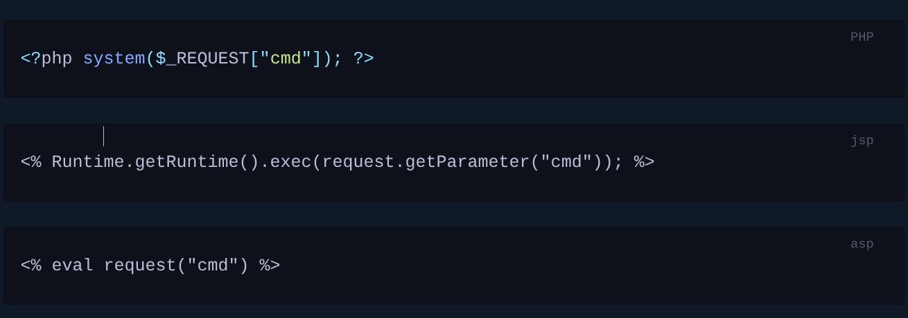

# Getting started

***

Use this page for first-pass concepts, common tools, and early service checks.

### Cheat sheets

| Cheat sheet                               | Focus                                          |
| ----------------------------------------- | ---------------------------------------------- |
| [Common ports](../cheat-sheets/page-3.md) | Default ports and quick service lookup         |
| [TMUX](../cheat-sheets/tmux.md)           | Session, window, and pane shortcuts            |
| [VIM](../cheat-sheets/vim.md)             | Fast editing and navigation                    |
| [Nmap](../cheat-sheets/nmap.md)           | Common scans, NSE scripts, and banner grabbing |

## Common Terms

### Shell :

The shell is a program that takes the input from the user and passes these commands to OS (Operating System) to perform a specific function.

<figure><figcaption></figcaption></figure>

### Port :

Ports are virtual points where network connections begin and end.

They allow a computer to route different types of traffic simultaneously over a single network connection by mapping specific data streams to distinct software processes (e.g., SSH vs. web requests).



<figure><figcaption></figcaption></figure>

### Web Server :

Software running on a host machine that directly handles HTTP/HTTPS traffic from a client browser over TCP ports 80 and 443.

It processes incoming requests, maps them to physical files, or hands them off to the application backend and it has a huge attack surface.

Attack Surface Breakdown:

Web Server Vulnerabilities and Web Application Flaws (OWASP Top 10)



## Common Tools

### Using SSH :

Secure Shell is a network protocol that runs on port 22 by default and provides users a secure way to access a computer remotely.

SSH can be configured with password authentication or passwordless using public-key authentication using public/private key-pair.

<figure><figcaption></figcaption></figure>

### Using Netcat :

Netcat, ncat or nc is used to interact with TCP/UDP Ports.

It can be used for many things during a pentest.

Its primary usage is for connecting to shells.

Netcat can be used to connect to any listening port and interact with the service on that port

<figure><figcaption></figcaption></figure>

Netcat can be used this way to obtain the banner running on that Port and IP.

This is called as Banner Grabbing.

Netcat can also be used to transfer files.

```
nc -nv <Target_IP> <Target_Port>
```

Then there is also Socat which is called as Netcat on steriods.A [standalone binary](https://github.com/andrew-d/static-binaries) of `Socat` can be transferred to a system after obtaining remote code execution to get a more stable reverse shell connection.

Socat also supports forwarding ports and connecting to serial devices.

1. **Port Forwarding :**

When you hack a target network, you often find a central server (like a database) that is completely hidden from the internet behind a firewall.

You cannot talk to it directly.

But if you have already compromised the public web server sitting right next to it, you can tell that web server: _"Take any traffic I send to you on Port X, and automatically forward it to the hidden database on Port Y."_

2. **Connecting to Serial Devices :**

* Serial Devices: Physical hardware components (like routers, IoT devices, or microchips) that transmit data sequentially, one bit at a time.
* Security Purpose: Involves physically opening a device's casing, connecting a cable directly to diagnostic pins on the circuit board (like UART), and using tools to read raw data or drop straight into a root command line without a network connection and password.

### TMUX :

Terminal multiplexers, like `tmux` or `Screen`, are great utilities for expanding a standard Linux terminal's features, like having multiple windows within one terminal and jumping between them.



### VIM:

Vim is a great text editor that can be used for writing code or editing text files on Linux systems.



## Service Scanning

### Nmap :

Nmap is used to scan ports and let us know the services that are running.

Basic nmap scan (scans 1000 most common ports by default and by default it runs a tcp scan) :

<figure><figcaption></figcaption></figure>

```
nmap IP
```

We can use the `-sC` parameter to specify that `Nmap` scripts should be used to try and obtain more detailed information. The `-sV` parameter instructs `Nmap` to perform a version scan. In this scan, Nmap will fingerprint services on the target system and identify the service protocol, application name, and version. The version scan is underpinned by a comprehensive database of over 1,000 service signatures. Finally, `-p-` tells Nmap that we want to scan all 65,535 TCP ports.

<br>

<figure><figcaption></figcaption></figure>

```
nmap -sV -sC -p- IP
```

-sV → version detection (what software + version)\
-sC → run default scripts (extra info gathering)\
-p- → scan all 65535 ports (not just top 1000)

### Nmap Scripts :

Specifying `-sC` will run many useful default scripts against a target, but there are cases when running a specific script is required.

```
nmap --script <script-name> IP
nmap --script ftp-anon IP          # check anonymous FTP
```

```
nmap --script vuln IP              # check known vulns
nmap --script ftp-anon IP          # anonymous FTP check
nmap --script http-enum IP         # web enumeration
nmap --script smb-vuln-ms17-010 IP # EternalBlue check
```

## Attacking Network Services

### Banner Grabbing :

**Fingerprinting** = identifying exactly what is running on a target.

Like a human fingerprint — unique to each person. Every service leaves identifying information.

**Banner grabbing is one way to fingerprint :**

```
# Using Nmap
nmap -sV --script=banner IP

# Using Netcat manually
nc -nv 10.129.42.253 21

# Response:
220 (vsFTPd 3.0.3)
→ FTP server, version 3.0.3
```

Generic info → "FTP is running"\
Fingerprinted → "vsFTPd 3.0.3 is running"

Generic → can't find specific exploits\
Fingerprinted → Google "vsFTPd 3.0.3 CVE"\
→ find backdoor vulnerability\
→ exploit it

### FTP :

`Nmap` scan of the default port for FTP (21) reveals the vsftpd 3.0.3 installation that we identified previously. Further, it also reports that anonymous authentication is enabled and that a `pub` directory is available.

<figure><figcaption></figcaption></figure>

<figure><figcaption></figcaption></figure>

<figure><figcaption></figcaption></figure>

### SMB :

